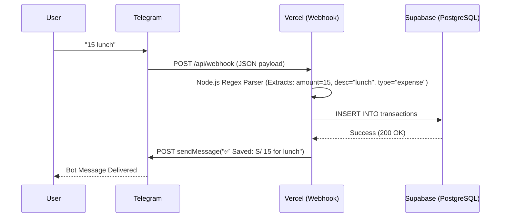

# Technical & Commercial Due Diligence - Valanze

This document is intended for technical auditors, potential investors, and technical co-founders to understand the underlying business model, unit economics, and architectural decisions behind Valanze.

## 1. Executive Commercial Summary
*   **The Problem:** Existing personal finance applications (B2C) and small business accounting tools (B2B) suffer from high churn rates due to data-entry friction. Users abandon complex apps after 3 days.
*   **The Solution:** A conversational interface (Chatbot) that leverages the user's existing habit of messaging. By removing the need to open an app, navigate menus, and click fields, data entry becomes instantaneous.
*   **Target Market (LATAM Sandbox):** Professionals (25-45 years old) who generate regular income but lack financial visibility. 
*   **Monetization Strategy:** SaaS Freemium model. Basic logging and 30-day history are free. Premium features (Voice notes parsing, Web Analytics Dashboard, Excel Export) will be locked behind a paywall (Approx. $2.70 USD / S/. 9.90 PEN monthly).

## 2. Unit Economics (Infrastructure Costs)
Valanze's architecture is designed to be highly profitable from Day 1 by relying entirely on Serverless compute and Free-tier messaging APIs.

| Service | Current Cost | Scale Cost (10k DAU) | Purpose |
| :--- | :--- | :--- | :--- |
| **Telegram API** | $0 | $0 | User Interface & Messaging Infrastructure. |
| **Vercel (Compute)** | $0 (Hobby) | $20/mo (Pro) | Hosts the Webhook and CRON jobs. Cold starts are negligible for chat apps. |
| **Supabase (DB)** | $0 (Free) | $25/mo (Pro) | PostgreSQL database and Row Level Security. |
| **Total MRR Cost** | **$0** | **$45/mo** | Profit margins exceed 95% at scale. |

## 3. System Architecture
The platform relies on a stateless webhook model.

## 4. Database Schema
The foundational table `transactions` is designed to be simple but scalable for analytics.

*   `id`: UUID (Primary Key, auto-generated)
*   `telegramId`: BigInt (Maps to the Telegram User ID, acts as the unique identifier)
*   `username`: String (For personalized notifications)
*   `amount`: Decimal (Financial value)
*   `description`: String (Raw concept, e.g., "lunch")
*   `type`: String ("ingreso" | "gasto")
*   `fecha`: Timestamp (Defaults to `now()`)
*   `rawText`: String (The exact original message for auditing and future NLP training)

## 5. Security & Privacy Posture
1.  **No Bank Linkage:** Valanze operates completely offline from banks. A security breach cannot result in stolen funds.
2.  **Stateless Compute:** Vercel functions hold no user data in memory after execution.
3.  **Webhook Authentication:** The Vercel endpoints validate Telegram's secret tokens to prevent unauthorized POST requests.

## 6. Future Scalability (Product Roadmap Tech)
As the user base grows, the system will evolve:
1.  **AI Auto-Categorization:** Replacing the basic Regex parser with a lightweight LLM API (OpenAI/Anthropic) to automatically tag transactions (e.g., "taxi" -> `Transport`, "burger" -> `Food`).
2.  **Web Dashboard (Next.js):** Connecting Supabase to a React/Next.js frontend using Supabase Auth (Magic Links via Telegram) so users can view pie charts of their spending.
3.  **B2B Pivot Architecture:** Introducing Multi-Tenancy (Row Level Security by `hotel_id` or `company_id`) to adapt the bot for business inventory and petty cash management.
