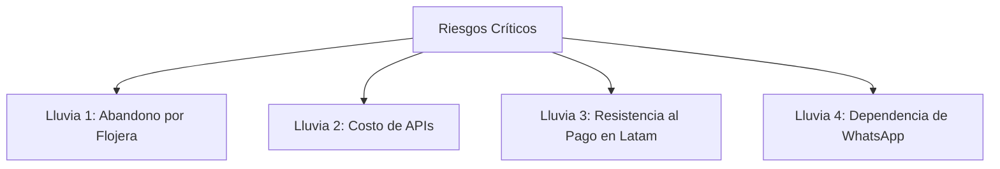

# Análisis de Lluvia Ácida: ¿Tiene sentido el negocio ante Meta AI y Gemini?

Este análisis evalúa críticamente la idea de negocio. Compara nuestra propuesta de valor con el uso de Inteligencia Artificial general (como chatear con Meta AI en WhatsApp o crear un "Gem" en Gemini) y expone los riesgos más duros (lluvias ácidas), qué podemos resolver, qué no podemos resolver y dónde perdemos.

---

## 1. Frente a Meta AI y Gemini Gems: ¿Por qué no usar una IA general?

Un usuario escéptico podría decir: *“¿Para qué pagar S/. 9.90 por tu app si puedo abrir Meta AI en mi WhatsApp gratis, escribirle 'Gasté 20 soles en taxi' y pedirle que me controle los gastos?”*

Aquí está la diferencia técnica y de producto real:

### A. Persistencia de Datos y Base de Datos Estructurada
*   **El problema de Meta AI / Gemini**: Son modelos conversacionales con "memoria volátil" (context window). Si le escribes tus gastos diariamente, a los 3 meses la IA habrá olvidado tus primeros gastos, los confundirá o **alucinará** los números. No tiene una base de datos relacional (PostgreSQL) conectada detrás.
*   **Nuestra solución**: El chat es solo la *interfaz de entrada*. El dato extraído se guarda de forma estructurada e inmutable en **Supabase (PostgreSQL)** o **Google Sheets**. Si en 6 meses preguntas por tus gastos de hoy, el dato estará intacto en una celda o fila exacta.

### B. El Dashboard Visual (Gráficos y Filtros)
*   **El problema de Meta AI / Gemini**: No pueden generar gráficos interactivos de pastel en tiempo real, ni te permiten filtrar gastos por rango de fechas (ej: *"Muéstrame solo lo que gasté del 5 al 12 de marzo"*), ni tienen un buscador de transacciones. Solo te devuelven texto largo.
*   **Nuestra solución**: Al lado del chat (o en un link dinámico de reporte), el usuario tiene un panel web responsivo que se redibuja al instante con gráficos interactivos y tablas dinámicas.

### C. Privacidad Financiera
*   **El problema de Meta AI / Gemini**: Todo lo que escribes en Meta AI entrena a los modelos de Meta y se asocia a tu perfil publicitario.
*   **Nuestra solución**: Base de datos dedicada y privada. Prometemos no vender datos a terceros y ofrecemos la opción offline o Google Sheets donde el usuario es dueño absoluto de sus datos.

---

## 2. Lluvia Ácida: Riesgos Críticos y Cruda Realidad

### Lluvia 1: El Abandono por Flojera (Fricción de Registro)
*   **La crítica**: Aunque registrar por chat sea fácil, el usuario promedio es perezoso. Olvidará escribirle al bot después de comprar un chicle o pagar el micro.
*   **Lo que SÍ podemos resolver**: Implementar **notificaciones proactivas de recordatorio (Nudges)**. El bot te escribe en horas clave (ej: 2:00 PM después de almorzar, o 8:00 PM al final del día) con un mensaje corto: *"Hola, ¿yapeaste o gastaste algo en la tarde?"*. Esto reduce el olvido en un 40%.
*   **Lo que NO podemos resolver (Dónde PERDEMOS)**: Perdemos frente a la automatización absoluta de las apps bancarias en consumos 100% con tarjeta. Si un usuario no usa efectivo y solo paga con tarjeta de débito, las apps de los bancos siempre registrarán con menos esfuerzo.

### Lluvia 2: El Costo de las APIs (Margen Evaporado)
*   **La crítica**: Si usamos modelos de lenguaje grandes (como Gemini Pro o GPT-4) para analizar cada mensaje de chat de S/. 0.05, y el usuario chatea 150 veces al mes, el costo de las APIs consumirá todo nuestro margen de ganancia de la suscripción.
*   **Cómo resolverlo**: **Arquitectura de Parser Híbrida**:
    1.  *Nivel 1 (Regex/Gramática local)*: El 80% de los mensajes siguen patrones idénticos (*"Yapeé X en Y"*, *"Gasté X en Y"*). Esto se procesa gratis en JavaScript local sin usar IA.
    2.  *Nivel 2 (Micro-modelos)*: Si el Nivel 1 falla, se envía a un modelo ultra-barato como *Gemini 1.5 Flash* o *GPT-3.5 Turbo*, minimizando el costo a fracciones de centavo de dólar.
*   **Dónde PERDEMOS**: Si el usuario escribe testamentos o lenguaje sumamente ambiguo que requiere análisis humano, el bot fallará en la categorización o será muy costoso de procesar.

### Lluvia 3: La Resistencia de Pago por Suscripción en Perú/Latam
*   **La crítica**: El usuario peruano promedio odia las suscripciones mensuales de software. Pagar S/. 9.90 al mes por una app de finanzas se siente como un "gasto innecesario" para alguien que justamente busca ahorrar.
*   **Cómo resolverlo (Pivotar Monetización)**: No dependas solo de la suscripción.
    *   *Monetización de Afiliados*: Ofrece la app gratis, pero genera comisiones recomendando productos financieros. Ej: *"Tienes S/. 1,000 acumulados en efectivo. Ligo (fintech peruana) ofrece 7% de interés. Abre tu cuenta aquí"*. La fintech nos paga una comisión por cliente referido.
    *   *Sponsor de Categorías*: Alianzas con marcas para dar beneficios dentro del bot (ej: cuando registran un gasto en taxi, dar un cupón de descuento de Cabify).
*   **Dónde PERDEMOS**: En la monetización rápida de SaaS tradicional. El crecimiento en Latam será lento si forzamos un muro de pago obligatorio desde el inicio.

### Lluvia 4: La Barrera de Entrada en WhatsApp
*   **La crítica**: WhatsApp (Meta) es muy estricto con los bots financieros. Los costos de su API oficial son altos para un MVP.
*   **Cómo resolverlo**: Lanzar el MVP en **Telegram** y como **Aplicación Web instalable en el celular (PWA)**. Es gratis, no requiere aprobaciones de Meta, y nos permite validar la UX rápidamente antes de invertir dinero en la API de WhatsApp.

---

## 3. Conclusión: ¿Tiene sentido el negocio o pivotamos?

**Tiene sentido total si nos posicionamos correctamente:**
El negocio **no es vender Inteligencia Artificial** (eso ya lo commoditizó Meta y Google). El negocio es vender **el orden automatizado de tus datos en una interfaz privada y visual**.

### Nuestra Propuesta de Valor Blindada:
> *"No somos un bot de conversación general; somos un **buzón inteligente de depósito de gastos** que inyecta tus datos en una base de datos segura y te los devuelve en gráficos limpios, recordándote ahorrar de forma proactiva y peruana."*
