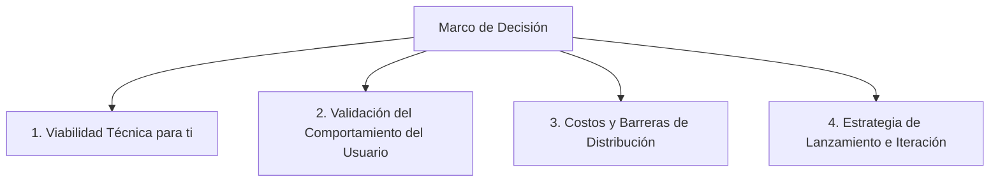

# Marco de Decisión y Procesos para Seleccionar tu MVP

Para tomar una decisión informada y reducir el riesgo antes de escribir la primera línea de código, es útil estructurar el análisis en **cuatro dimensiones clave**. 

Este documento presenta el proceso de evaluación que te ayudará a elegir la mejor opción (Google Sheets, PC Offline o App Móvil) según la información disponible y lo que puedes investigar en la calle.

---

## 1. Las Cuatro Dimensiones de Análisis



### Dimensión 1: Viabilidad Técnica y Operativa (Para ti como creador)
Dado que no tienes experiencia técnica, el proceso de desarrollo debe ser fluido para ti.
* **Qué evaluar**: ¿Qué tan difícil es para ti abrir la app, probar cambios y hacer demostraciones a otros?
* **Análisis**: 
  * Las **Opciones 1 (Sheets)** y **2 (PC Offline)** son archivos web tradicionales. Se ejecutan con un doble clic en tu PC o abriendo un enlace. Son ideales para un no-programador.
  * La **Opción 3 (Móvil)** requiere configurar herramientas en tu sistema Windows que suelen dar errores de compatibilidad y requieren mantenimiento constante.

### Dimensión 2: Validación de la Experiencia del Usuario (UX)
Debes entender *cómo* y *dónde* prefiere registrar los gastos tu usuario objetivo en Perú.
* **Qué investigar (Trabajo de Campo)**: Pregunta a 5 personas de tu entorno (amigos, familiares) cómo registran sus gastos hoy y hazles estas preguntas:
  1. *¿Registras tus gastos en el momento exacto en que compras algo (en la calle) o prefieres hacerlo al final del día/semana?*
  2. *Si pudieras registrar un gasto enviando un mensaje de chat (ej: "15 soles en almuerzo"), ¿lo usarías?*
  3. *¿Te daría miedo que esa app estuviera conectada a tu banco, o prefieres que sea manual/privada?*
* **Análisis**:
  * Si la gente registra **al final del día**: La **Opción 2 (PC)** o **Opción 1 (Sheets en PC)** es suficiente.
  * Si la gente registra **en la calle**: Se requiere un formato móvil. Sin embargo, la **Opción 1 (Sheets)** se puede abrir desde el navegador del celular (como una web adaptada), lo que cubre esta necesidad sin crear una app móvil nativa.

### Dimensión 3: Costos, Infraestructura y Distribución
* **Qué evaluar**: El presupuesto inicial y los canales de distribución para llegar a los usuarios.
* **Análisis**:
  * **Opción 1 (Google Sheets)**: Costo $0. Distribución inmediata compartiendo un enlace web.
  * **Opción 2 (PC Offline)**: Costo $0. Distribución enviando un archivo ejecutable/ZIP.
  * **Opción 3 (Móvil)**: Requiere pagar la licencia de Google Play ($25 USD) o Apple ($99 USD/año) para que otros la descarguen fácilmente, o instalarla manualmente mediante cables USB, lo cual es inviable para usuarios comunes.

### Dimensión 4: Valor del "Entregable" (¿Qué obtiene el usuario?)
* **Qué evaluar**: ¿Qué valora más el cliente? ¿El registro fácil o el análisis de los datos?
* **Análisis**:
  * Si valoran el **análisis profundo**: La **Opción 1 (Google Sheets)** es imbatible. El usuario promedio de Excel/Sheets valora tener sus datos ordenados en celdas para hacer sus propios cálculos.
  * Si valoran la **sencillez absoluta**: La **Opción 2 (PC)** o **Opción 3 (Móvil)** con gráficos sencillos en pantalla es mejor.

---

## 2. Matriz de Decisión y Puntuación (1 al 5)

Asignando puntajes basados en tu contexto actual (1 = Muy desfavorable, 5 = Muy favorable):

| Criterio | Opción 1: Google Sheets | Opción 2: PC Offline | Opción 3: App Móvil (Android) |
| :--- | :---: | :---: | :---: |
| **Facilidad para que tú la pruebes** | **5** | **5** | **1** (requiere configurar SDKs en tu PC) |
| **Velocidad de construcción (MVP)** | **5** (pocos días) | **4** (requiere base de datos local) | **2** (semanas de desarrollo y pruebas) |
| **Utilidad real para el usuario** | **5** (Google Sheets es una gran herramienta) | **3** (limitado a estar frente a la PC) | **5** (siempre a la mano en el bolsillo) |
| **Costo financiero de lanzamiento** | **5** ($0 USD) | **5** ($0 USD) | **3** (costo de tiendas y servidores de bases de datos) |
| **Facilidad de distribución a clientes**| **5** (solo envías un link) | **3** (enviar un archivo instalador) | **2** (subir a tiendas / instalar APKs) |
| **PUNTUACIÓN TOTAL** | **25 / 25** (Ganador recomendado) | **20 / 25** | **13 / 25** |

---

## 3. Proceso Recomendado para Tomar tu Decisión (Paso a Paso)

Si quieres estar 100% seguro(a) antes de construir, te sugiero este micro-proceso de validación de 3 días:

```
[Día 1: Entrevistas Rápidas] ---> [Día 2: Probar un Prototipo Web en tu PC] ---> [Día 3: Decisión Final]
(Preguntar a 5 personas)         (Yo te construyo una interfaz básica)         (Elegimos la ruta definitiva)
```

1. **Paso 1: Entrevistas Rápidas (Día 1)**:
   * Habla con 3 a 5 personas en Perú que yapeen o gasten dinero diario. Pregúntales: *"¿Si pudieras apuntar tus gastos enviándole un mensaje rápido a un bot que te lo ordena todo en un Excel, lo usarías?"*
2. **Paso 2: Construir un Prototipo de Prueba de Concepto (Día 2)**:
   * Yo puedo programarte hoy mismo una **página web básica interactiva** (que simule la Opción 1 o 2). Podrás abrirla en tu computadora con un doble clic, escribir en el chat simulado y ver cómo se procesa la información.
3. **Paso 3: Evaluación y Elección (Día 3)**:
   * Basándote en el prototipo y las entrevistas, elegimos la opción definitiva para estructurar el plan de trabajo completo.
