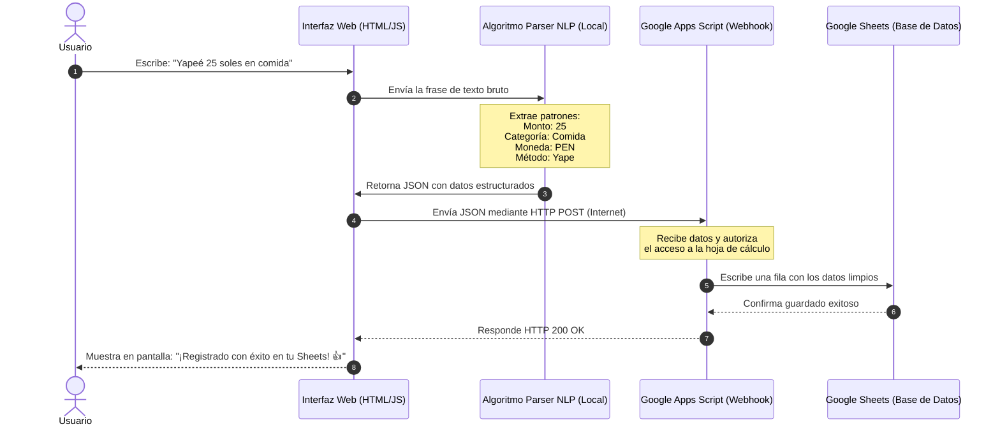
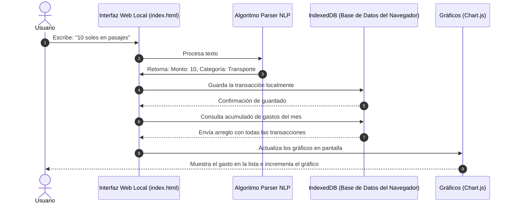
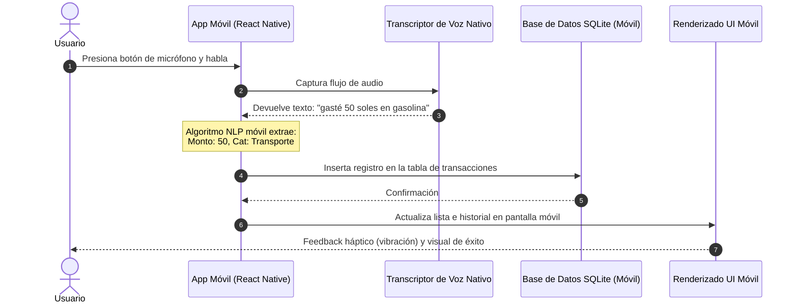

# Ingeniería de Flujos y Validación del MVP

Este documento contiene dos secciones clave para avanzar con tu proyecto:
1. **Guía de Validación de Mercado (Formulario de Google)**: Preguntas exactas y configuración para entrevistar a tus usuarios potenciales.
2. **Ingeniería de Flujos e Infraestructura Técnica**: El "detrás de escena" de cómo viajan los datos en cada una de las 3 opciones de MVP.

---

## PARTE 1: Guía para Elaborar el Formulario de Google (Validación)

Para validar si las personas en tu mercado (Perú/Latam) realmente necesitan y usarían una app conversacional, crea un formulario en **Google Forms** con la siguiente estructura:

### Configuración General del Formulario
* **Título del Formulario**: Estudio sobre Hábitos de Gasto y Control de Dinero 🇵🇪
* **Descripción**: *Hola. Estamos diseñando una nueva herramienta digital para facilitar el control de los gastos del día a día de forma rápida y sencilla. Tus respuestas nos ayudarán a crear una solución a tu medida. No te tomará más de 3 minutos. ¡Muchas gracias por tu apoyo!*

---

### Preguntas del Formulario (Estructura y Tipos)

#### Sección 1: Perfil General del Usuario
1. **¿Qué edad tienes?**
   * *Tipo*: Varias opciones (Radio Button)
   * *Opciones*: Menos de 18 | 18 - 25 | 26 - 35 | 36 - 50 | Más de 50
2. **¿En qué ciudad/país resides actualmente?**
   * *Tipo*: Respuesta corta (Texto)
   * *Ejemplo de respuesta*: *Lima, Perú*

#### Sección 2: Hábitos de Gasto y Pago diario
3. **¿Qué medios de pago utilizas con más frecuencia en tu día a día?** *(Selecciona todas las que apliquen)*
   * *Tipo*: Casillas (Checkbox)
   * *Opciones*: 
     - [ ] Efectivo (Billetes/Monedas)
     - [ ] Yape / Plin
     - [ ] Tarjeta de Débito
     - [ ] Tarjeta de Crédito
     - [ ] Transferencia Bancaria
4. **¿Llevas actualmente un registro o control de tus ingresos y gastos?**
   * *Tipo*: Varias opciones (Radio Button)
   * *Opciones*:
     - Sí, apunto todo religiosamente.
     - Sí, pero a veces se me olvida y lo dejo.
     - No, solo reviso el saldo de mis cuentas de vez en cuando.
     - No llevo ningún control.
5. **Si respondiste SÍ a la anterior, ¿qué herramienta utilizas?**
   * *Tipo*: Varias opciones (Radio Button) + Opción "Otro"
   * *Opciones*:
     - Una aplicación móvil de finanzas (ej: Monefy, Wallet, Mobills).
     - Una hoja de cálculo (Excel / Google Sheets).
     - Una libreta física / apuntes de papel.
     - Un grupo de WhatsApp o notas en el celular conmigo mismo.

#### Sección 3: Validación del Dolor ("Gastos Hormiga" y Olvidos)
6. **¿Con qué frecuencia sientes que "no sabes en qué se te fue el dinero" a fin de mes?**
   * *Tipo*: Escala lineal (1 al 5)
   * *Etiquetas*: 1 = Nunca me pasa | 5 = Me pasa todos los meses
7. **¿Cuál es el mayor obstáculo para registrar tus gastos diarios?** *(Selecciona un máximo de 2)*
   * *Tipo*: Casillas (Checkbox)
   * *Opciones*:
     - [ ] Es aburrido y toma mucho tiempo abrir la app y meter los datos.
     - [ ] Se me olvida apuntar los gastos pequeños (café, pasajes, golosinas).
     - [ ] Hago muchos pagos en efectivo y es difícil recordarlos todos.
     - [ ] Me da desconfianza conectar mis cuentas bancarias a aplicaciones de terceros.

#### Sección 4: Validación de la Solución (Finanzas Conversacionales)
8. **Si pudieras registrar un gasto simplemente enviando un mensaje de texto o un audio de voz corto (ej: *"Yapeé 15 soles por almuerzo"* o *"Gasto de 10 soles en taxi"*), ¿qué tan útil te resultaría?**
   * *Tipo*: Escala lineal (1 al 5)
   * *Etiquetas*: 1 = Nada útil / No lo usaría | 5 = Extremadamente útil / Lo usaría a diario
9. **¿Qué canal preferirías usar para enviar estos mensajes?**
   * *Tipo*: Varias opciones (Radio Button)
   * *Opciones*:
     - Una aplicación web o móvil propia (independiente).
     - Un Bot de WhatsApp (dentro de mi WhatsApp diario).
     - Un Bot de Telegram.
10. **¿Dónde te gustaría ver reflejados tus reportes y presupuestos?**
    * *Tipo*: Varias opciones (Radio Button)
    * *Opciones*:
      - En un panel de gráficos interactivos dentro de la misma aplicación.
      - En una hoja de Google Sheets personalizada y sincronizada.
      - Ambas opciones.

---

## PARTE 2: Ingeniería de Flujos y Stack de Tecnologías

A continuación se detalla cómo funciona internamente la transmisión de datos para cada una de las 3 opciones de MVP.

---

### Opción 1: Entrada Conversacional $\rightarrow$ Google Sheets

Este flujo procesa el texto ingresado por el usuario en una web, extrae los datos clave y los envía a Google Drive mediante un script intermedio.

#### Stack de Tecnologías Utilizado:
* **Frontend**: HTML5, CSS3 (Vanilla con diseño premium) y JavaScript (ES6+).
* **Procesamiento de Lenguaje (NLP)**: Librería ligera en JavaScript local (ej: *compromise.js* o expresiones regulares estructuradas). No requiere servidores costosos.
* **Backend e Integración**: Google Apps Script (código Javascript que corre gratis en los servidores de Google y tiene acceso directo a tus hojas de cálculo).
* **Almacenamiento/Base de datos**: Google Sheets.
* **Costo**: **$0 USD** (Usa la capa gratuita de Google Drive).

---

### Opción 2: App de PC 100% Offline (Sin Internet)

Toda la lógica de procesamiento, almacenamiento y visualización gráfica ocurre en el propio navegador de la computadora del usuario, sin enviar datos a la red.

#### Stack de Tecnologías Utilizado:
* **Frontend**: HTML5, CSS3 (con modo oscuro y tarjetas translúcidas) y Vanilla JavaScript.
* **Base de Datos Local**: `IndexedDB` o `LocalStorage` (motores de bases de datos integrados en Chrome/Edge).
* **Librería de Gráficos**: *Chart.js* (permite generar gráficos dinámicos de dona, barras o líneas de forma local y ligera).
* **Exportación**: JavaScript para convertir la base de datos a un archivo de Excel comprimido (`.csv`) descargable con un botón.
* **Costo**: **$0 USD** (Funciona en tu disco duro local).

---

### Opción 3: Aplicación Móvil (Android)

Este flujo requiere compilar código para teléfonos y configurar bases de datos embebidas.

#### Stack de Tecnologías Utilizado:
* **Entorno de Desarrollo**: Node.js, Android Studio (en Windows), Java SDK.
* **Framework móvil**: React Native con Expo (permite escribir en JavaScript y compilar a código nativo de Android).
* **Base de Datos**: `SQLite` (base de datos relacional ultraligera integrada directamente en los archivos de la app del teléfono).
* **Componente de Audio**: Módulo `expo-speech` o la API de reconocimiento de voz integrada del sistema operativo Android.
* **Costo**: **$0 USD** para desarrollo local. Si se quiere subir a la tienda oficial de Android (Google Play), requiere un pago único de **$25 USD**.
